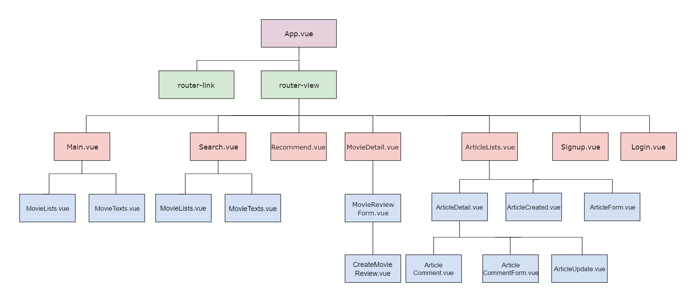
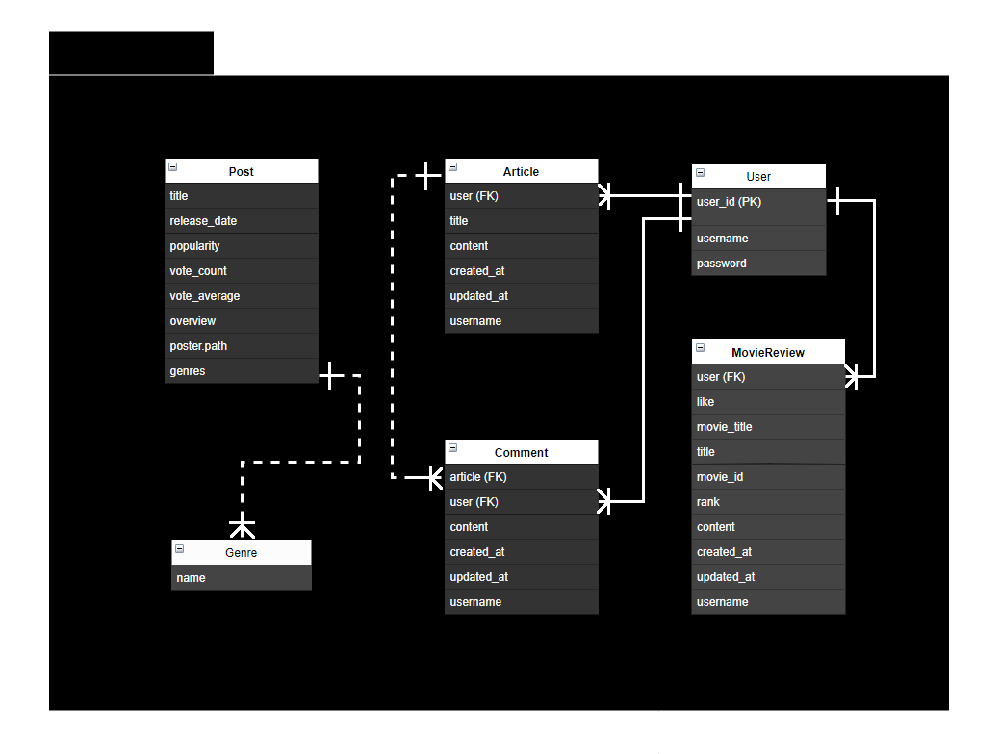
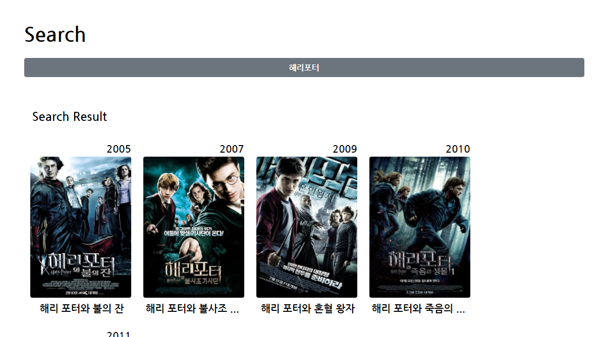
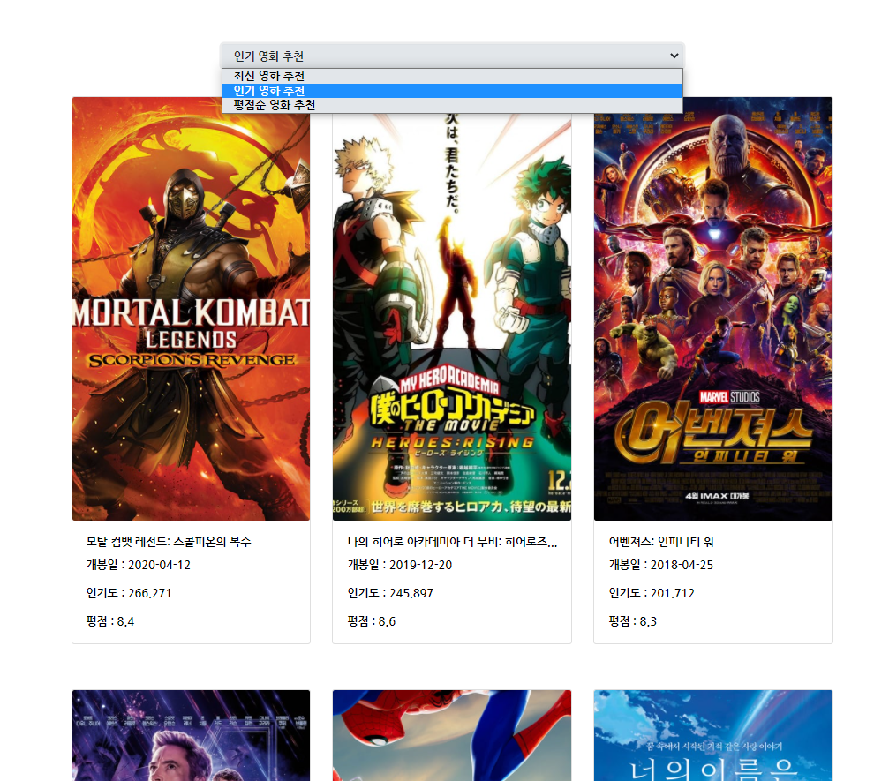
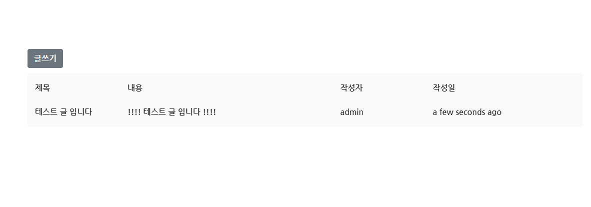
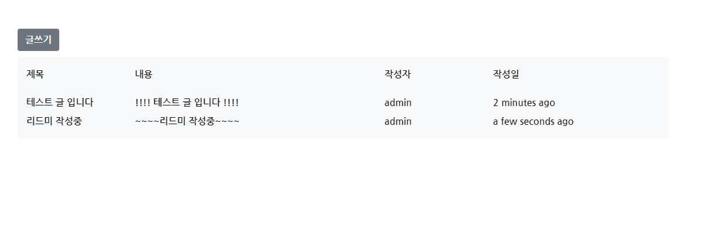
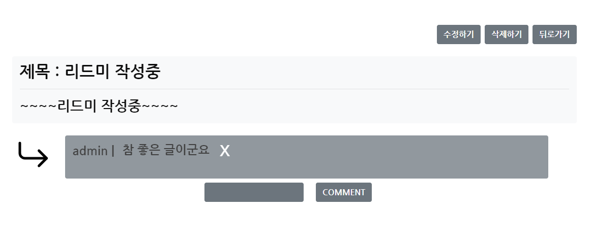
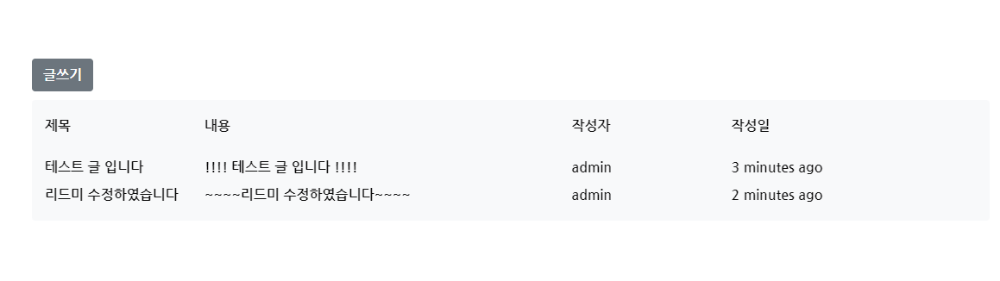
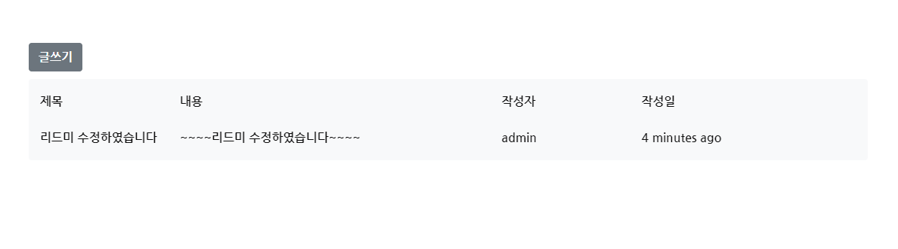

# Final-Pjt

[TOC]

## 제작기간

2021.05.20 - 2020.05.27

## 팀원소개

- 정원화(팀장)
- 김다윗 

## 📗 시작 전 CHECK_LIST

### :ballot_box_with_check: pip 설치

> 프로젝트에 필요한 pip를 설치한다. 

- `final-pjt-back/requirements.txt` 파일을 참조한다.
- 주어진 JSON 파일을 DB에 로드 `$ python manage.py loaddata movies.json`

### :ballot_box_with_check: npm 설치

- npm 사용을 위해서 `node.js`와 `Vue Cli`가 설치되어 있는지 확인한다.
- `final-pjt-front` 폴더 안에서 아래의 명령어를 실행해본다.

```bash
$ node -v
```

```bash
$ vue --version
```

- 이후 아래의 npm을 설치한다.

```bash
$ npm install
```

- 기본 Vue 프로젝트 생성 이후, 추가적으로 설치한 npm은 아래와 같다.

```bash
$ npm install axios
$ npm install bootstrap-icons
$ npm install bootstrap-vue
$ npm install moment
$ npm install vue-router
$ npm install vuex
```

### :ballot_box_with_check: .env.local

> Vue 클라이언트 프로젝트의 최상위 폴더에는 `.env.local` 파일이 작성되어 있으며, 이것은 gitignore로 관리되어 있기 때문에 반드시 해당 파일을 생성하고 프로젝트를 진행하도록 한다.

- `.env.local` 파일에는 다음과 같은 데이터가 저장되어 있다.
  - `서버 url`
  - API_KEY

```
VUE_APP_SERVER_URL=http://127.0.0.1:8000
VUE_APP_THEMOVIEDB_API_KEY="5baac7ac711a4bc84e4d345fc917a4da"
```


## 1 .팀원 정보 및 업무 분담 내역

### 공통업무 : front 및 back 기본 모델링 / 

### 팀장 : 정원화

- 

### 팀원 : 김다윗

- 

  

## 2. 목표 서비스 구현 및 실제 구현 정도

### 2.1 목표 서비스

> 우리 팀이 처음에 기획한 서비스는 다음과 같다.

```markdown
## 1. 영화 조회 서비스
- DB 기반 전체 영화 조회
- 장르별 영화 조회
- 영화 상세 조회
- Youtube 영상 제공
## 2. 영화 추천 서비스
- 이상형 월드컵 형식 영화 추천 : 이상형 월드컵을 통해 사용자가 선호하는 장르를 데이터로 받아 이에 해당하는 장르가 많이 포함된 영화 추천
## 3. community 기능
- 영화 리뷰 및 평점 작성
- 댓글 작성
```


### 2.2 실제 구현 서비스

- 컴포넌트 구조 



```markdown
## 1. 영화 조회 서비스
- API 데이터 기반 영화조회 서비스
- 조회한 영화 정보 및 Youtube 영상 제공
## 2. 영화 추천 서비스
- 랜덤 추천
## 3. community 기능
- 영화 리뷰 및 평점 작성
- 댓글 작성
```


## 3. 데이터베이스 모델링(ERD)



### 1. articles app의 Models.py 

* MovieReview Model - User와 MovieReview (1:N 관계)  

- Article Model - User와 Article (1:N 관계)  
- Comment Model  - User와 Comment (1:N관계)
- Comment Model - article 와 comment (1:N관계)

```python
from django.db import models
from django.conf import settings

class MovieReview(models.Model):
    user = models.ForeignKey(settings.AUTH_USER_MODEL, on_delete=models.CASCADE, related_name="movie_reviews")
    movie_title = models.CharField(max_length=50)
    title = models.CharField(max_length=100)
    movie_id = models.IntegerField()
    rank = models.IntegerField(default=1)
    content = models.TextField()
    created_at = models.DateTimeField(auto_now_add=True)
    updated_at = models.DateTimeField(auto_now=True)
    username = models.CharField(max_length=100)


class Article(models.Model):
    user = models.ForeignKey(settings.AUTH_USER_MODEL, on_delete=models.CASCADE)
    title = models.CharField(max_length=100)
    content = models.TextField()
    created_at = models.DateTimeField(auto_now_add=True)
    updated_at = models.DateTimeField(auto_now=True)
    username = models.CharField(max_length=100)


class Comment(models.Model):
    article = models.ForeignKey(Article, on_delete=models.CASCADE)
    user = models.ForeignKey(settings.AUTH_USER_MODEL, on_delete=models.CASCADE)
    content = models.TextField()
    created_at = models.DateTimeField(auto_now_add=True)
    updated_at = models.DateTimeField(auto_now=True)
    username = models.CharField(max_length=100)
```

### 2. posts app의 Models.py 

- Post Model - post 와 genre(1:N 관계)  

```python
from django.db import models

class Genre(models.Model):
    name = models.CharField(max_length=50)

class Post(models.Model):
    title = models.CharField(max_length=100)
    release_date = models.DateField()
    popularity = models.FloatField()
    vote_count = models.IntegerField()
    vote_average = models.FloatField()
    overview = models.TextField()
    poster_path = models.CharField(max_length=200)
    genres = models.ManyToManyField(Genre)
```


## 4. 필수 기능에 대한 설명

### 4.1  영화목록 조회 

* store/index.js

```javascript
import Vue from 'vue'
import Vuex from 'vuex'

Vue.use(Vuex)

export default new Vuex.Store({
  state: {
    loading: true,
    nowPlaying:[],
    popular:[],
    upComing:[]
  },
  mutations: {
    SET_LOADING(state, data){
      state.loading = data;
    },
    SET_NOW_PLAYING(state, data){
      state.nowPlaying = data;
    },
    SET_POPULAR(state, data){
      state.popular = data;
    },
    SET_UP_COMING(state, data){
      state.upComing = data;
    }
    
  },
  actions: {
  },
  modules: {
  }
})

```

- utils/axios.js

```javascript
import axios from "axios"

const DOMAIN = "https://api.themoviedb.org/3/"
const API_KEY = process.env.VUE_APP_THEMOVIEDB_API_KEY
const request = axios.create({
  baseURL: "https://api.themoviedb.org/3/",
  params: {
    api_key: API_KEY,
    language: "ko-KR",
  },
});
export const movieApi = {
  nowPlaying: () => request.get("movie/now_playing"),
  popular: () => request.get("movie/popular"),
  upComing: () => request.get("movie/upcoming"),
  movieDetail: (id) =>
    request.get(`movie/${id}`, {
      params: { append_to_response: "videos" },
    }),
  search: (keyword) =>
    request.get(`search/movie/`, {
      params: {
        query: keyword,
      },
    }),
}
```

* Search.vue



```javascript
export default {
  data(){
    return {
      keyword:"",
      movieList:""
    }
  },
  components:{
    MovieText,
    MovieLists
  },
  created(){
  this.SET_LOADING(false)
  },
  methods:{
    ...mapMutations(["SET_LOADING"]),
    async onSearch(){
      this.SET_LOADING(true)
      console.log(this.keyword)
      if(!this.keyword){
          alert("영화 제목을 입력하세요!")
          this.keyword = ""
          return
      }
      const {data} = await movieApi.search(this.keyword)
      console.log(data)
      this.movieList=data.results
      this.SET_LOADING(false)
      this.keyword = ""
    },
  }
}
```

- MovieLists.vue 

```javascript
export default {
  props: ['movieList'],
  data(){
    return {
      noImage: require("../assets/error.jpg")
    }
  }
,
  methods: {
    image(img) {
      return `https://image.tmdb.org/t/p/w300/${img}`
    },
     goDetail(id){
      // console.log(id)
      this.$router.push(`detail/${id}`)
    }
  },
}
```

- MovieListsVuex.vue

```vue
import { mapState } from 'vuex'
export default {


  computed:{
    ...mapState(["nowPlaying"])
  },
  methods: {
    image(img) {
      return `https://image.tmdb.org/t/p/w300/${img}`
    },
    goDetail(id){
      // console.log(id)
      this.$router.push(`detail/${id}`)
    }
  },
}
```

* MovieDetail.vue


```javascript
const SERVER_URL = process.env.VUE_APP_SERVER_URL

export default {
  data() {
    return {
      movieDetail: {},
      Reviews : [],
      me : localStorage.getItem('username')
    }
  },
  async mounted() {
    this.SET_LOADING(true)
    console.log(this.$route)
    console.log(this.$route.params.id)
    const { id } = this.$route.params
    const { data } = await movieApi.movieDetail(id)
    // axios 요청 보내기
    console.log(data)
    this.movieDetail = data
    this.SET_LOADING(false)
    // backdro
  },
  methods: {
    ...mapMutations(["SET_LOADING"]),
    image(img) {
      console.log()
      return `https://image.tmdb.org/t/p/original/${img}`
    },
    youtube(src) {
      return `https://www.youtube.com/embed/${src}`
    },
    setToken : function () {
      const token = localStorage.getItem('jwt')
      const config = {
        headers : {
          Authorization : `JWT ${token}`,
        }
      }
      return config
    },
    getStar (rank) {
      let rankStar = '★'
      for (let i=1;i<rank;i++){
        rankStar += '★'
      }
      return rankStar
    },
    onDelete : function (review) {
      const config = this.setToken()
      axios.delete(`${SERVER_URL}/articles/movie_review_delete/${review.id}/`,config)
      .then(()=>{
      this.$router.go(this.$router.currentRoute)
      })
      .catch((err)=>{
        console.log(err)
      })
    },
  },
  created: function () {
    const config = this.setToken()
    axios.get(`${SERVER_URL}/articles/movie_review_list_create/`,config)
    .then((res)=>{  
      this.Reviews = res.data
      }).catch((err)=>{
      console.log(err)
    })  
  }
}
```


### 4.2 추천 서비스

- Recommend.vue에서 카테고리 선택하여 추천 
  - 최신, 인기, 평점을 기준으로 각각 선택하는 목록에 대하여 정렬하여 보여줌



```javascript
<template>
    ...
    <select v-model="mode" class="btn btn-light border d-flex justify-content-start form-select mb-4" style="width:30%">
      <option value="latest">최신 영화 추천</option>
      <option value="popular">인기 영화 추천</option>
      <option value="vote">평점순 영화 추천</option>
    </select>
	...
</template>

export default {
  data : function () {
    return {
      mode: 'latest',
      movieList: [],
    } 
  },
  methods : {
    setToken : function () {
      const token = localStorage.getItem('jwt')
      const config = {
        headers : {
          Authorization : `JWT ${token}`,
        }
      }
      return config
    },
    getMovies: function () {
      const config = this.setToken()
      const mode = this.mode
      axios.get(`${SERVER_URL}/posts/recommended?mode=${mode}`,config, {params: {mode: this.mode}})
      .then((res)=>{  
        this.movieList = res.data
        }).catch((err)=>{
        console.log(err)
        })
      },
  },
  watch: {
    mode: {
      handler: function () {
        this.getMovies()
      }
    }
  },
  created: function () {
    this.getMovies()
  }
}
```


### 4.3  커뮤니티 기능 

- article 쓰기, 수정, 삭제 기능 구현 

  - 쓰기 (ArticleCreated)

  

  

  

  ```javascript
    methods : {
      onArticle : function () {
        const Article = {
          title: this.title,
          content: this.content,
          username: this.username,
        }
  
        axios({
            method: 'POST',
            url: SERVER_URL + '/articles/',
            headers: {
            Authorization: `JWT ${localStorage.getItem('jwt')}`
          },
          data: Article
        }).then(() => {
            this.$router.push({name : "ArticleList"})
          }).catch((err) => {
            console.log(err)
          })
      }
    }   
  ```

  - 수정  (ArticleUpdate)

  

  

  ```javascript
  methods : {
        setToken : function () {
        const token = localStorage.getItem('jwt')
        const config = {
          headers : {
            Authorization : `JWT ${token}`,
          }
        }
        return config
      },
      onArticle : function () {
        const config = this.setToken()
        axios.put(`${SERVER_URL}/articles/${this.$route.params.review.id}/`,this.Article,config)
        .then((res)=>{
          console.log(res)
          this.$router.push({name : "ArticleList"})
        }).catch((err)=>{
          console.log(err)
        })
      }
    }
  ```

  

  - 삭제  (ArticleDetail)

  

  ```javascript
      methods : {
      setToken : function () {
        const token = localStorage.getItem('jwt')
        const config = {
          headers : {
            Authorization : `JWT ${token}`,
          }
        }
        return config
      },
      onDelete : function (id) {
        const config = this.setToken()
        axios.delete(`${SERVER_URL}/articles/${id}/`,config)
        .then(()=>{
          this.$router.push({name : 'ArticleList'})
        })
        .catch((err)=>{
          console.log(err)
        })
      }
    },
  ```

  


  